# Manual de Usuario
## Programa de Arboles Binarios

El programa de arboles binarios tiene como función principal manipular estructuras de datos enfocadas a Arboles Binarios de Búsqueda y Arboles AVL (Adelson–Velskii y Landis). El programa se ha trabajado con el lenguaje de programación Java y está específicamente creado para tratar con información relacionada a registros de vacunación, cuenta con diversas funciones como: 

1. Agregar Nodos
2. Búsqueda de Nodos
3. Modificación de Nodos
4. Eliminación de Nodos
5. Rcorridos de Árbol
    * Preorden
    * Inorden
    * Postorden

## Descripcion de Árboles Binarios de Búsqueda
Se trata de una estructura que almacena información de distinto tipo de dato y dispone de dos referencias que permiten un camino hacia el resto de datos de manera recursiva. La estructura consta de Nodos, donde es posible almacenar y enlazar la información dentro del árbol; el elemento principal es la raíz, a través de la cual se van posicionando los hijos y subárboles que se van generando conforme su inserción. Este tipo de estructura depende de una regla o condición para direccionamiento o enlace de los nodos, que consiste en: para una raíz cuyo valor numérico ha sido establecido como primer elemento, los siguientes nodos cuyo valor numérico sean menor a la raíz estarán posicionados a la izquierda y en caso de ser un valor numérico mayor serán enlazados del lado derecho. De esta manera recibe su segunda condición, pues únicamente constará de dos elementos por nodo, es decir, un hijo o subárboles izquierdo y uno derecho. De ahí su nombre Árbol Binario.

## Descripción de Árboles AVL
Este tipo de estructura mantienen las mismas características en cuanto a elementos y condiciones, agregando como regla el "factor de equilibrio" que a diferencia del ABB permite visualizar un árbol binario mejor estructurado, puesto que su lado izquierdo y derecho se verán mejor balanceados. 

Este factor de equilibrio establece que: para cada recorrido a partir de la raíz, se debe contabilizar el número de hijos o nodos del lado izquierdo y derecho respectivamente, cuya diferencia (resta) debe estar condicionado en mayor o igual a dos del lado derecho, o menor a menos dos del lado izquierdo para hacer "rotaciones". Estos cambios o rotaciones modifican la estructura del árbol para que las posiciones de los nodos sea mejor ubicada y siempre se encuentre equilibrado en cada inserción.
El siguiente cuadro establece de manera resumida las condiciones que debe darse, las rotaciones existentes y necesarias: 

Nodo Actual | FE Izquierdo | FE Derecho | Rotacion
--- | --- | --- | ---
-2 | -1 | N/A | Rotación Derecha
-2 | 1 | N/A  | Rotación Izquierda Derecha
2 | N/A  | -1  | Rotación Derecha Izquierda
2 | N/A  | 1  | Rotació Izquierda

# Interfaz principal del programa
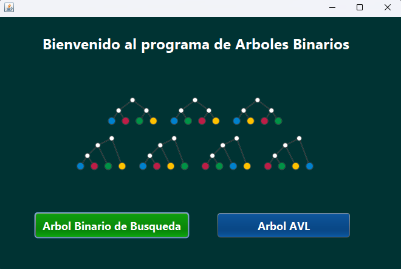

Esta es la pantalla de bienvenida al ejecutar el programa en donde se puede elegir el tipo de arbol con el que se va a trabajar oprimiendo el botón que corresponde al árbol, sin embargo, para ambos tipos de arboles se ha trabajado la misma interfaz para simplificar y familiarizar al usuario con el uso del programa.

## Interfaz para los árboles binarios 
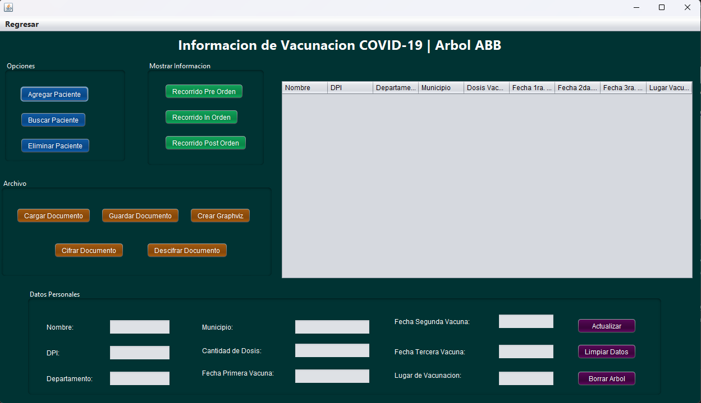

En esta interfaz pueden observarse las funciones disponibles del programa, se tiene separado por bloques aquellas opciones que corresponden al grupo de funciones asociadas, a continuación se detallarán cada una de ellas.

## Sección de Opciones
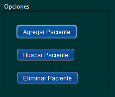

* En esta sección el usuario puede inicializar con la estructura del árbol binario, agregando mediante el botón "Agregar Paciente" la raíz del arbol y por ende los siguientes pacientes cada vez que oprime el botón, el cual le solicitará los siguientes datos: "Nombre del paciente" y "DPI". Cada vez que los datos sean ingresarlos, la información se verá reflejada en la tabla de datos en recorrido Preorden.

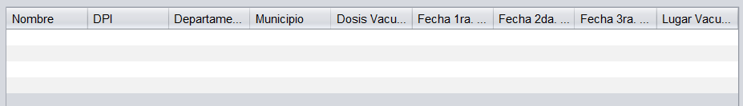

* La opción "Eliminar Paciente" solicita al usuario el "DPI del Paciente" para poder localizar el nodo y de esa manera eliminarlo.

* El botón "Buscar Paciente" le permite al usuario ingresar el "DPI del Paciente" para localizarlo y con ello se le habilita la seccion de "Datos Personales" para modificación de datos como: "Departamento", "Municipio", entre otros.

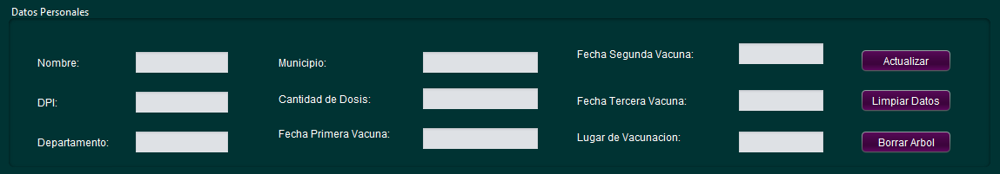

* En esta sección el usuario dispone de la opción "Actualizar" que recibe todos los datos agregados a los campos de texto y luego los muestra en la tabla.

* El botón "Limpiar Datos" le facilita al usuario el trabajo de borrar elementos uno a uno, incluyendo la tabla.

* La siguiente opción de "Borrar Arbol" hace que todo el trabajo detrás de la interfaz sea suprimido, con ello el usuario puede "empezar de 0" agregando, eliminando y modificando datos si así lo desea.

* En la sección de "Mostrar Información" se tienen los recorridos que permite hacer el programa y se apoya de la tabla para mostrar el orden de seleccionado.

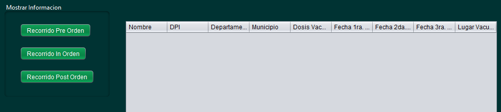

* Por último en la sección de "Archivo" el usuario dispone de funciones para "Cargar Documento" lo que le permite trabajar con información guardada  en un archivo de texto y visualizarla en la tabla mediante el recorrido preferido o habilitar la modificación de información personal mediante el botón "Buscar Paciente". Para cargar el documento se debe ubicar y seleccionar el archivo entre los archivos del sistema.

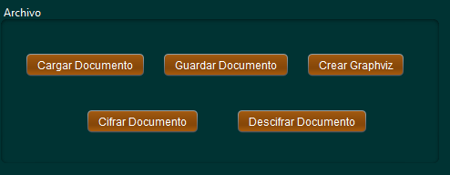

* "Guardar Documento" es la manera de salvar la información trabajada en tabla y edición de pacientes.

* Por otro lado, la opción "Cifrar Documento" permite al usuario poder codificar los datos en caso de que necesite mayor seguridad y mediante "Descrifrar Documento" puede regresar la información nuevamente a su estado original.

* La opción "Crear Graphviz" es la mejor manera de visualizar ambos árboles, ya que genera una imagen del trabajo realizado y esta se puede encontrar en los archivos principales del programa en formato "png".

# Ejemplo con flujo de trabajo

A continuación se detallará un caso de aplicación del programa para una mejor comprensión de su utilidad.

1. Se iniciará la carga de información mediante la carga de documento, buscando en los archivos del sistema el documento a utilizar y posteriormente seleccionando "Open" para visualizar la información en la tabla.

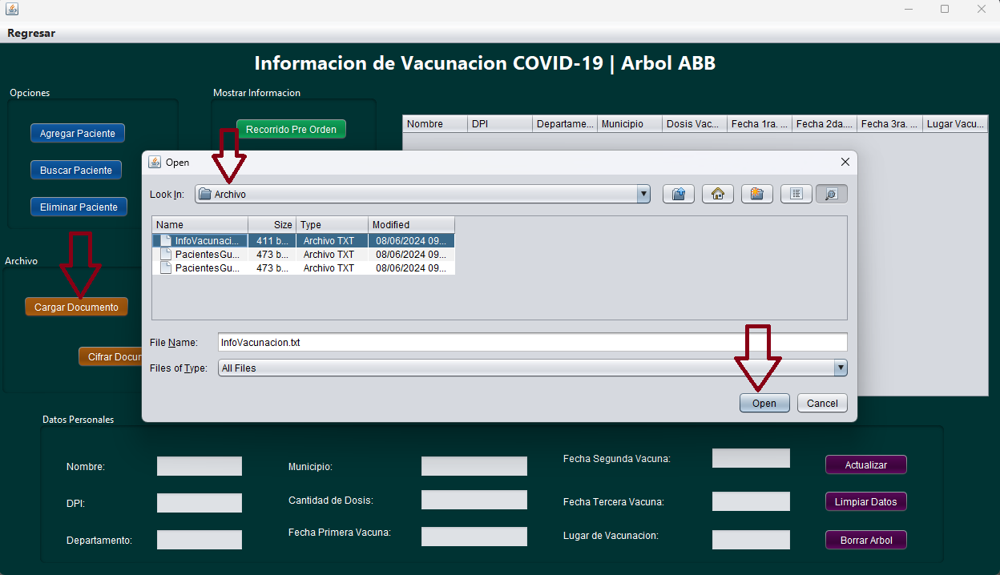

2. Ahora se buscará un paciente mediante su DPI colocando la numeración en la ventana emergente y seleccionando "Ok" para habilitar la edición de los datos.

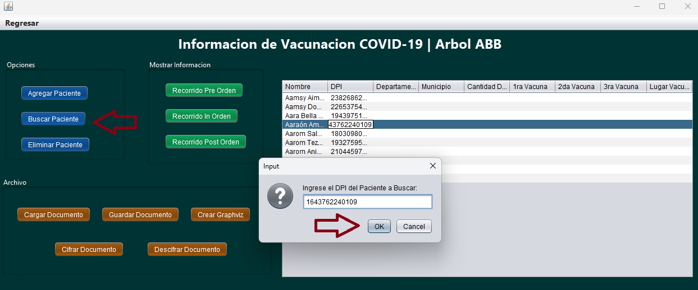

3. Una vez se haya agregado la información del paciente se procede a oprimir "Actualizar" para ver los cambios reflejados.

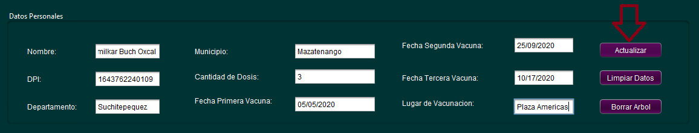

4. Si desea agregar informacion de manera manual puede realizarse con "Agregar Paciente" ingresando la información en las ventanas emergentes correspondientes al nombre y DPI.

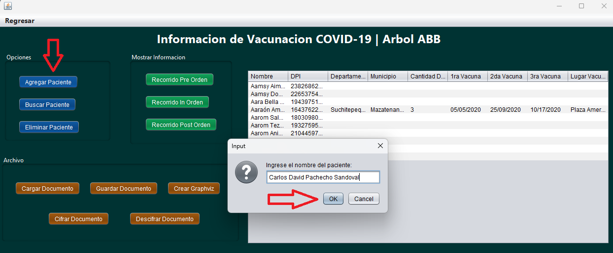

5. Para no perder la información trabajada, se debe seleccionar la opción de Guardar Documento, en caso de que desee guardar con mayor seguridad primero asegúrese de utilizar "Cifrar Documento".

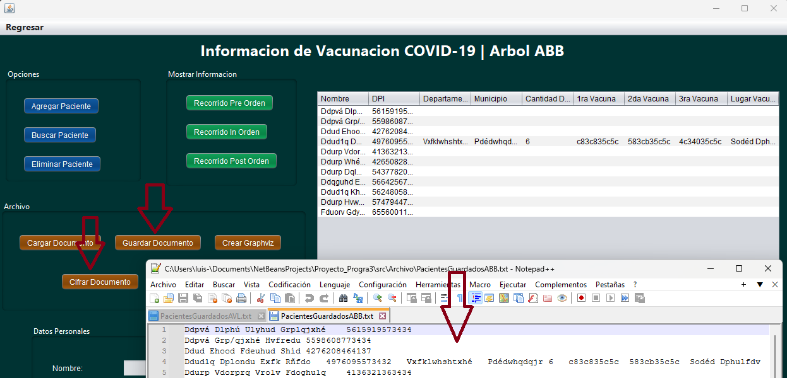

6. Si desea regresar su documento a la normalidad, debe seleccionar "Descifrar Documento", si ya ha guardado la información cifrada también puede cargar su documento cifrado para reconvertilo y guardarlo nuevamente. NOTA: Si a este punto decide agregar nueva información, es recomendable que primero decodifique la información anterior, ya que el programa tomará los nuevos datos no codificados y al descodificar los datos anteriores no quedarán acorde a su naturalidad. Para evitar esos errores dispone de la opcion "Borrar Arbol" y empezar nuevamente con la seleccion de documentos

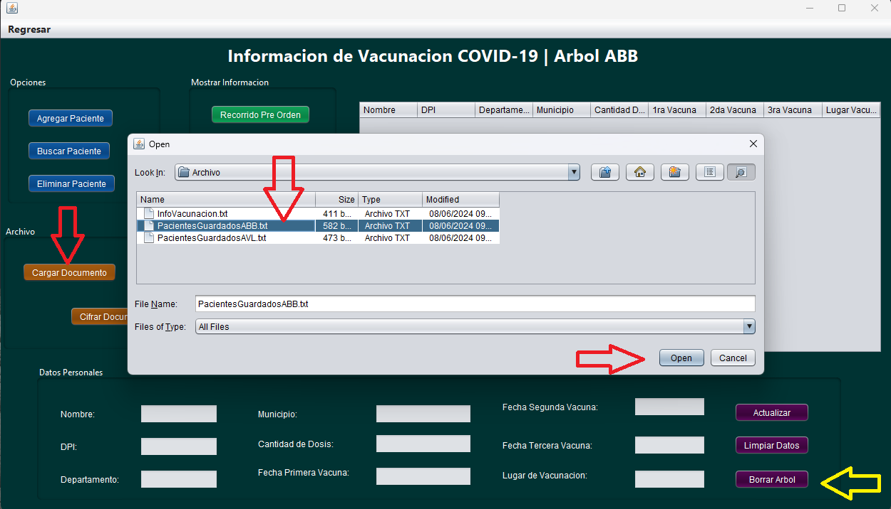

7. Puede eliminar pacientes con el botón correspondiente ingresando el DPI del paciente en la ventana emergente.

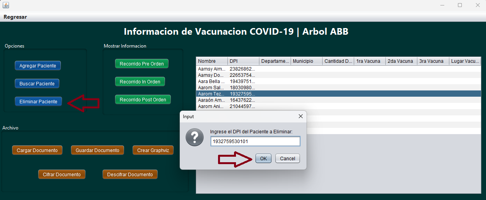

8. Para visualizar el arbol debe seleccionar "Crear Graphviz" y el archivo se generará dentro de la carpeta del programa.

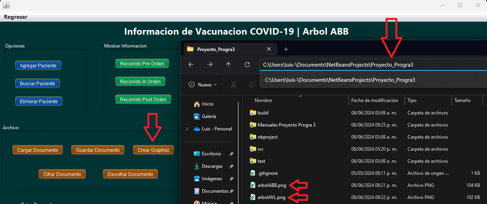

* Arbol de ejemplo graficado (Arbol ABB)

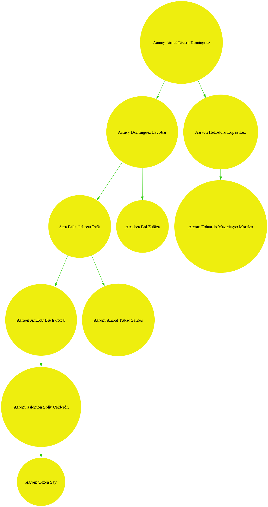

* Arbol de ejemplo graficado (Arbol ABL)

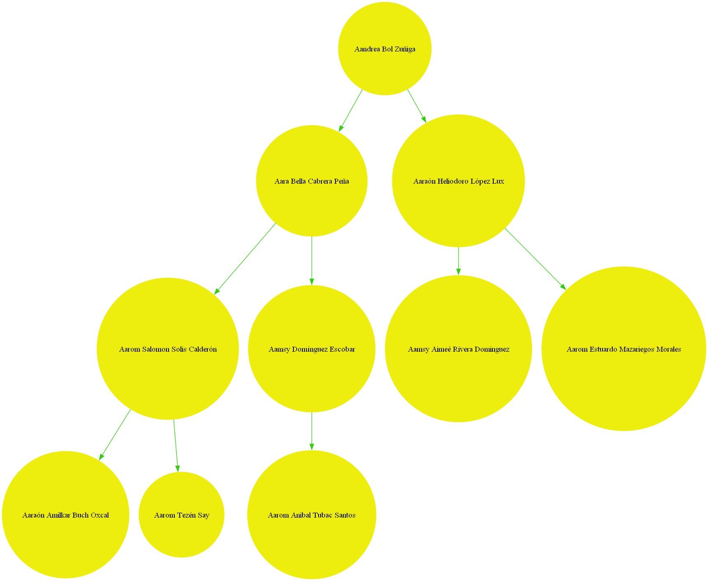

* NOTA: Los flujos presentados son aplicables para ambos árboles, debido a que la interfaz es la misma y su funcionamiento no varía a excepción del árbol gráfico. Por último para cambiar entre una interfaz u otra, se dispone del opción "Regresar" en la parte superior izquierda para cambiar entre interfaces.